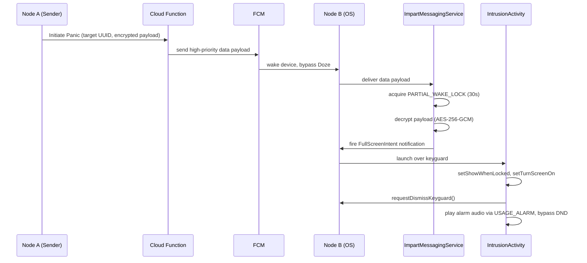

<!-- Engineered by uncoalesced -->
# Architecture & Technology Stack

---

## 1. Technology Stack

| Layer | Choice | Notes |
|---|---|---|
| Platform | Native Android | Min SDK 26 (Android 8.0 Oreo), Target SDK 34+ |
| Language | Kotlin | 100% Kotlin, no Java interop by design |
| UI Toolkit | Jetpack Compose | Exclusively. No XML layouts, no Fragments |
| Dependency Injection | Dagger Hilt | `@HiltAndroidApp`, `@AndroidEntryPoint`, `@Inject` constructor injection |
| Transport / Signaling | Firebase Cloud Messaging — **Data Payloads only** | Never Notification payloads |
| Backend / Logic | Firebase Cloud Functions (Node.js / TypeScript) | Stateless routing + FCM dispatch |
| Local Storage (structured) | Room Database, encrypted via SQLCipher | Stores the Contact Matrix |
| Local Storage (key-value) | EncryptedSharedPreferences | Stores session flags, non-relational state |
| Auth | Firebase Authentication | Anchors a Firebase UID to an Impart UUID |

## 2. Architectural Style: Event-Driven, OS-First

Impart is built around a single governing constraint: **the app cannot be trusted to be running.** Android will suspend it, Doze it, or kill it. Any architecture that assumes otherwise is already broken.

The solution is an Event-Driven Architecture (EDA) where the *event* — a high-priority FCM data payload — is capable of resurrecting the app from a fully stopped state. The flow is OS-first: the operating system, not the application, is the thing waking up. The application is just what runs once the OS has already done the hard part.



## 3. Why FCM Data Payloads, Not Notification Payloads

This is the single most important transport decision in the system, so it's worth being explicit about why.

A **Notification Payload** is intercepted by the Android system tray automatically. If the app is backgrounded, the OS renders the notification itself — the app's code never runs, and the OS applies its own throttling, batching, and Doze-aware delivery windows. You cannot chain custom logic (wake lock acquisition, full-screen intent, alarm audio) off the back of a payload the OS already handled for you.

A **Data Payload** contains only a `data` object. It **always** invokes `onMessageReceived()` in the app's `FirebaseMessagingService` subclass, whether the app is foregrounded, backgrounded, or fully killed (with the OEM caveat in §5). This hands control back to Impart's own code the instant the message arrives, which is the only way to guarantee the WakeLock → FullScreenIntent → Alarm-Audio chain actually fires.

Setting `priority: "high"` on the FCM message is what allows it to breach Doze Mode's maintenance windows. FCM reserves high-priority delivery for exactly this class of use case — user-visible, time-critical content — which is precisely Impart's use case.

## 4. The Intrusion Pipeline — Mechanic by Mechanic

### 4.1 Ingress: Cloud Function → FCM

A Firebase Cloud Function receives the "Initiate Panic" call from the sender's device, resolves the target UUID to its current FCM token (looked up server-side, though the token itself was originally exchanged client-to-client during the handshake — see `03_SECURITY_PROTOCOL.md`), and dispatches a high-priority data-only message via the Firebase Admin SDK.

### 4.2 The Brain: `ImpartMessagingService`

`ImpartMessagingService` extends `FirebaseMessagingService` and overrides `onMessageReceived(RemoteMessage)`. This is where the entire intrusion sequence begins. Its responsibilities, in strict order:

1. Validate the payload structure.
2. Acquire a wake lock (below).
3. Decrypt the ciphertext.
4. Build and fire the full-screen-intent notification.

### 4.3 WakeLock Acquisition

```kotlin
val wakeLock = powerManager.newWakeLock(
    PowerManager.PARTIAL_WAKE_LOCK,
    "Impart::IntrusionWakeLock"
).apply { acquire(30_000L) } // 30s timeout — enough to build and fire the intent, not a second longer
```

A `PARTIAL_WAKE_LOCK` keeps the CPU running without necessarily lighting the screen — screen-on is handled separately, deliberately, via the full-screen intent flags on the activity itself. The 30-second timeout is a safety valve: if something in the decrypt/build pipeline hangs, the wake lock releases itself rather than draining the battery indefinitely.

### 4.4 The Bypass: `FullScreenIntent`

```kotlin
val pendingIntent = PendingIntent.getActivity(
    context, 0, intrusionIntent,
    PendingIntent.FLAG_UPDATE_CURRENT or PendingIntent.FLAG_IMMUTABLE
)

val notification = NotificationCompat.Builder(context, CHANNEL_ID)
    .setContentTitle("IMPART — PANIC")
    .setPriority(NotificationCompat.PRIORITY_MAX)
    .setCategory(NotificationCompat.CATEGORY_ALARM)
    .setFullScreenIntent(pendingIntent, true)
    .build()
```

`setFullScreenIntent(pendingIntent, true)` is the Android-sanctioned mechanism for launching an activity directly over the lock screen — the same API used by incoming call screens and alarm clock apps. It requires the `USE_FULL_SCREEN_INTENT` manifest permission, already granted in the current build. As of Android 14 (API 34), this permission is auto-granted at install only to apps the Play Store categorizes as calling/alarm apps; other apps require the user to manually enable it via Settings. This is a real risk to track as Impart moves past sideloading on your own devices toward any wider distribution — see `06_ROADMAP_AND_NEXT_STEPS.md`.

### 4.5 The Face: `IntrusionActivity`

```kotlin
override fun onCreate(savedInstanceState: Bundle?) {
    super.onCreate(savedInstanceState)
    setShowWhenLocked(true)
    setTurnScreenOn(true)
    val keyguardManager = getSystemService(KEYGUARD_SERVICE) as KeyguardManager
    keyguardManager.requestDismissKeyguard(this, null)
    setContent { IntrusionScreen(...) }
}
```

`setShowWhenLocked(true)` and `setTurnScreenOn(true)` are the modern (API 27+) replacements for the deprecated `FLAG_SHOW_WHEN_LOCKED` / `FLAG_TURN_SCREEN_ON` window flags. `requestDismissKeyguard()` attempts to dismiss an insecure keyguard outright; on a secure keyguard (PIN/pattern/biometric) it surfaces the activity above the lock screen but still requires the user to authenticate to fully unlock the device — the intrusion screen renders regardless, which satisfies the "undeniable alert" requirement even if full device unlock still needs a PIN.

### 4.6 Audio Override: `USAGE_ALARM`

```kotlin
val audioAttributes = AudioAttributes.Builder()
    .setUsage(AudioAttributes.USAGE_ALARM)
    .setContentType(AudioAttributes.CONTENT_TYPE_SONIFICATION)
    .build()
```

Routing playback through `USAGE_ALARM` places it in the same audio stream category as the device's own alarm clock — a stream Android's Do Not Disturb implementation deliberately does not silence, on the reasoning that a sleeping user still needs their alarm to go off. Impart borrows this same guarantee rather than fighting the OS.

## 5. Doze Mode & OEM Battery Management — Honest Caveats

FCM high-priority delivery reliably breaches **stock Android's** Doze Mode. It does **not** automatically survive every OEM's custom battery management layer. Be upfront about this, because it's a real gap:

- **Xiaomi (MIUI)** and other Chinese OEM skins aggressively kill background services and require the user to manually disable battery restrictions and enable "Autostart" for Impart.
- **Samsung (One UI)** has historically applied similar restrictions under "Put unused apps to sleep" / "Deep sleeping apps" lists.
- Impart's onboarding flow should detect the device manufacturer and, where possible, deep-link the user directly to the relevant OEM battery-exemption settings screen — a well-known pattern (see the open-source "Don't kill my app" project's per-OEM intent list for reference).

This is not a solved problem in the Android ecosystem broadly, and Impart should not overstate its reliability guarantee on non-stock OEM skins until this onboarding step exists.

## 6. Dependency Injection Topology

Hilt modules should be scoped as follows:

- `AppModule` (SingletonComponent) — provides `FirebaseMessaging`, `FirebaseAuth`, `PowerManager`, `KeyguardManager` singletons.
- `DatabaseModule` (SingletonComponent) — provides the encrypted Room database and its DAOs.
- `CryptoModule` (SingletonComponent) — provides the Android Keystore-backed key manager and the AES-GCM cipher wrapper.
- `NetworkModule` (SingletonComponent) — provides the Cloud Functions callable client.

Each is expanded further in `04_FILE_STRUCTURE_AND_STATE.md`.
