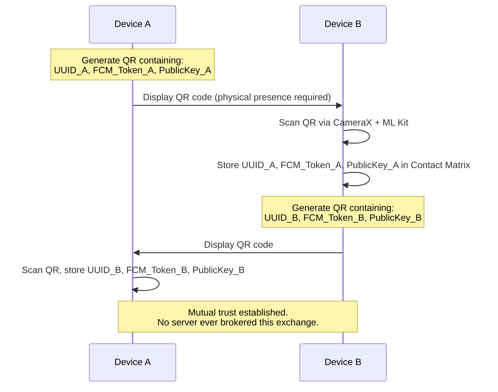

<!-- Engineered by uncoalesced -->
# Security Protocol — "Trust No One"

---

## 1. Threat Model & Trust Doctrine

Impart's security posture starts from an uncomfortable but necessary premise: **the infrastructure carrying the message is not trusted with its contents.** Firebase — meaning Google's servers, Firestore, and Cloud Functions — is treated as a relay, not a confidant. It is trusted to route ciphertext reliably. It is never trusted to see plaintext.

This has a concrete implication for every design decision downstream: if a piece of data would be meaningful to an attacker (or to Google itself) in plaintext, it must never exist in plaintext outside the sender's and receiver's devices.

## 2. Identity Layer: UUIDs

Every node in Impart is identified by a version-4 UUID, generated locally on first launch and never reused. The UUID is:

- **Not derived from personal information.** No phone number, no email, no device serial.
- **Immutable** once created — a new UUID means a new identity, with all existing trust relationships requiring re-establishment.
- **Meaningless without a corresponding trust record.** Possessing someone's UUID alone grants no capability; it must be paired with the public key and FCM token exchanged during the handshake below.

## 3. The Handshake Protocol

Trust in Impart is never established remotely. It is established through a single, deliberate, physical act: **scanning a QR code.**



The QR payload contains exactly three fields: the presenting device's UUID, its current FCM registration token, and its asymmetric public key (or a shared-secret seed — see §4.4 for why this is still an open decision). This is a two-way exchange; both devices must scan each other's codes for the trust relationship to be bidirectional, meaning either party can page the other.

**Why out-of-band matters:** because the exchange never touches Firebase, there is no remote code path — no API call, no cloud function, no database write — that can silently add a contact. Adding someone to your Contact Matrix requires their device to be physically present and cooperating. This closes off the entire class of "attacker adds themselves as a trusted contact remotely" attacks by construction, not by policy.

## 4. End-to-End Encryption Pipeline

### 4.1 Key Generation & Storage

Each device generates its own keypair (or key material — see §4.4) on first launch. The **private key never leaves the device** and is stored exclusively in the **Android Keystore system**, meaning it is generated inside, and — on supporting hardware — never extractable from, the device's secure hardware element. The public key is the only half that travels, via the QR handshake in §3.

### 4.2 Message Envelope Structure

Every payload sent between nodes — whether an "Initiate Panic" trigger or a future richer message type — is wrapped in a standard envelope before it ever reaches Firebase:

```json
{
  "senderUuid": "b3f1...-uuid",
  "nonce": "base64-96-bit-IV",
  "ciphertext": "base64-AES-256-GCM-output",
  "authTag": "base64-GCM-tag",
  "timestamp": 1751234567
}
```

- **`nonce`** — a freshly generated 96-bit initialization vector, unique per message. Reusing a nonce with the same key catastrophically breaks GCM's confidentiality guarantee, so this must be cryptographically random per send, never a counter that could collide across app reinstalls.
- **`ciphertext`** — the actual payload (e.g. `{"type": "PANIC", "message": "..."}`), encrypted under AES-256-GCM using key material derived from the handshake.
- **`authTag`** — GCM's built-in authentication tag, which lets the receiver detect any tampering with the ciphertext in transit and reject the message outright rather than decrypt corrupted or forged data.
- **`timestamp`** — used for replay-attack mitigation (§6).

### 4.3 Encryption / Decryption Pipeline

**Send path:** plaintext payload → JSON-serialize → AES-256-GCM encrypt (fresh nonce, key from the Contact Matrix record) → base64-encode → wrap in envelope → hand to Cloud Function → FCM.

**Receive path:** `ImpartMessagingService.onMessageReceived()` → extract envelope → look up sender's key material from the Contact Matrix by `senderUuid` → AES-256-GCM decrypt + verify auth tag → reject on failure, proceed to the intrusion pipeline on success.

### 4.4 Open Decision: Key-Agreement Scheme

The current context leaves this genuinely unresolved ("Asymmetric Public Key *or* shared secret"), and it should be decided deliberately rather than defaulted into, because it changes what the QR payload and the `ContactEntity` schema actually store:

- **ECDH over Curve25519** — each device has a long-term keypair; a per-contact shared AES key is derived via Diffie-Hellman at handshake time. Stronger forward-secrecy properties if you later add key rotation. More moving parts to implement correctly.
- **Pre-shared secret** — the QR code directly contains (or seeds) a shared AES key. Simpler to implement and reason about for a first Alpha. Weaker if you ever want per-message forward secrecy, and the secret itself is the single point of failure if the QR exchange is ever observed by a third party during the scan.

Resolve this before Phase 3 of `06_ROADMAP_AND_NEXT_STEPS.md` locks the `ContactEntity` schema — the fields differ meaningfully between the two approaches.

## 5. What the Server Can and Cannot See

Being explicit about this is a security requirement in itself — an honest threat model is one that doesn't overclaim.

**Google's servers (Firestore / Cloud Functions / FCM) can see:**
- That Node A sent *something* to Node B, and when.
- The size of the encrypted envelope.
- Both parties' FCM tokens and UUIDs (needed for routing, and not secret by design — they're only meaningful when paired with private key material neither Google nor an attacker possesses).

**Google's servers cannot see:**
- The plaintext content of any message.
- The nature of the alert (panic vs. a future non-emergency message type, if those are ever added).

This means Impart provides **confidentiality of content**, not **metadata privacy**. State that distinction plainly to anyone relying on the system, rather than implying it away.

## 6. Attack Surface & Mitigations

| Threat | Mitigation |
|---|---|
| Replay attack (attacker re-sends a captured envelope) | `timestamp` checked against a tolerance window (e.g. ±2 minutes) on receipt; stale envelopes are discarded |
| FCM token compromise / device loss | Trust records support **revocation** — removing a contact from the Contact Matrix invalidates their ability to page you. A lost/stolen device should trigger the owner to manually revoke its UUID from all counterpart Contact Matrices, since there's no central authority to do this for them |
| Man-in-the-middle during handshake | Mitigated structurally — the handshake requires physical co-presence for the QR scan, a stronger channel-authentication guarantee than any remote key-exchange protocol alone |
| Ciphertext tampering in transit | GCM authentication tag; any modification causes decryption to fail closed, not open |
| Private key extraction | Android Keystore-backed storage; on devices with a TEE or StrongBox, key material is not extractable even with root access |

## 7. Key Rotation & Revocation

Because Impart has no central identity authority by design, key rotation is a **manual, mutual re-handshake**: if a device's keypair is rotated (e.g. after a suspected compromise), every counterpart relationship must be re-established via a fresh QR exchange. This is a deliberate tradeoff — it sacrifices convenience for the guarantee that trust always traces back to a physical, verifiable act between two humans.
