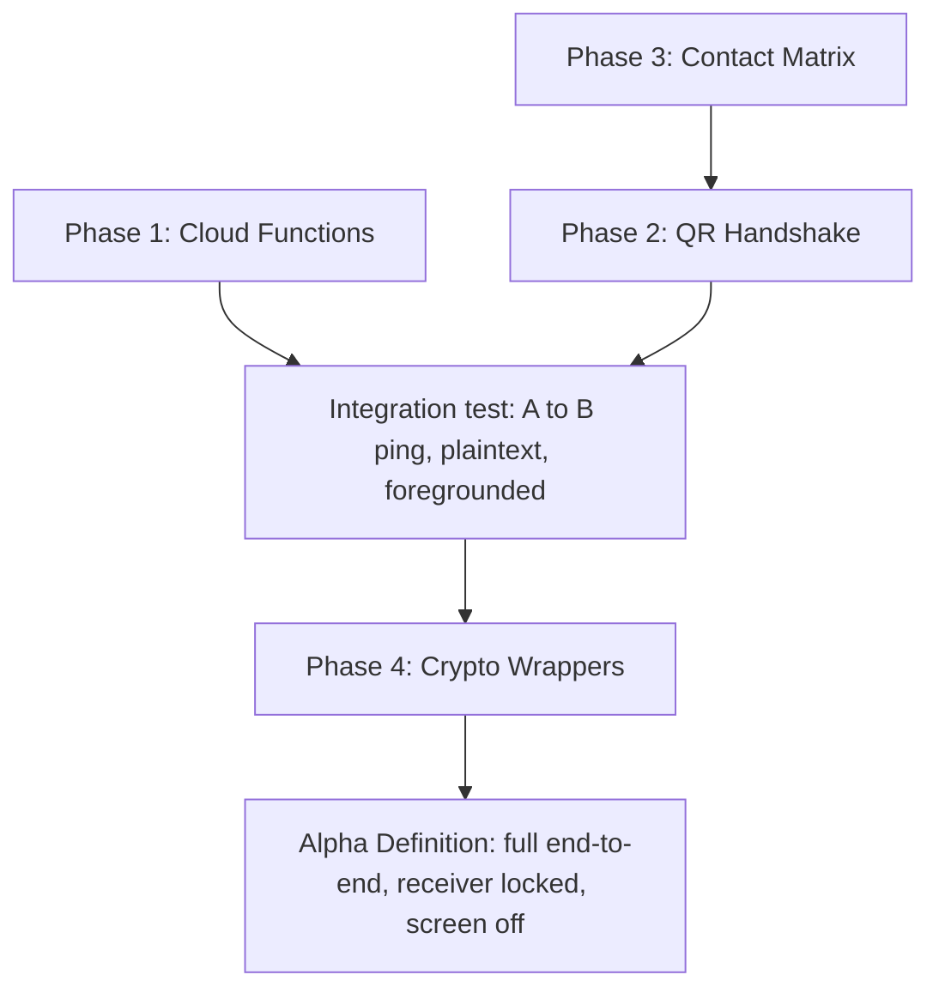

<!-- Engineered by uncoalesced -->
# Roadmap & Next Steps — Path to Alpha

---

## 1. Current State Snapshot

Built and functional today:

- `AndroidManifest.xml` — permissions and activity flags for the lock-screen bypass are in place.
- `ImpartApplication.kt` — Hilt entry point.
- `MainActivity.kt` — Compose control panel: notification permission handling, FCM token retrieval/display, "Simulate Alert (Local)" and "Initiate Panic" actions.
- `ui/IntrusionActivity.kt` — keyguard bypass logic, `ImpartTomato` palette.
- `core/services/ImpartMessagingService.kt` — FCM data-payload listener that fires the full-screen-intent notification.
- `build.gradle.kts` — Compose, Hilt, Firebase BoM, FCM, Auth, Firestore, Room all configured.

What's missing to go from "one device can locally simulate an alert" to "two devices can actually page each other end-to-end": server-side routing, a way to establish trust between two physical devices, somewhere durable to store that trust, and the encryption that makes the whole thing safe to send over Google's infrastructure. That's exactly the four phases below, in the order they unblock each other.

## 2. Phase 1 — Firebase Cloud Functions (Routing Layer)

**Why first:** without this, "Initiate Panic" has nowhere to send the ping — `MainActivity`'s button currently has no server-side counterpart.

- [ ] Scaffold `functions/` as a Node.js/TypeScript Firebase Functions project (`firebase init functions`).
- [ ] Implement `initiatePanic` as an `onCall` HTTPS Callable Function:
  - Accepts `{ targetUuid: string, envelope: EncryptedEnvelope }`.
  - Validates the calling user is authenticated (Firebase Auth) and, ideally, that a trust record exists — decide explicitly whether that check happens server-side or is left entirely to the client's own Contact Matrix, which is arguably more consistent with the "server sees nothing meaningful" doctrine in `03_SECURITY_PROTOCOL.md`.
  - Resolves `targetUuid` → current FCM token.
  - Dispatches via Admin SDK `messaging().send()` with `android: { priority: "high" }` and a `data`-only payload — never `notification`.
- [ ] Add a minimal `fcmDispatcher.ts` wrapper so the send-with-high-priority configuration lives in exactly one place, not copy-pasted across future callables.
- [ ] Deploy to a dev project and validate against a single real device before touching client code.

## 3. Phase 2 — QR Handshake UI (Generator + Scanner)

**Why second:** routing is useless without a way for two devices to know about each other's UUID/token/public key. This phase makes the trust model in `03_SECURITY_PROTOCOL.md` real.

- [ ] Add `CameraX` + `ML Kit Barcode Scanning` dependencies.
- [ ] Build `QrGeneratorScreen.kt` — renders the local device's `{uuid, fcmToken, publicKey}` as a QR code (a lightweight QR-generation library, e.g. ZXing's `core` module, is sufficient — scanning is handled separately by ML Kit).
- [ ] Build `QrScannerScreen.kt` — live camera preview via CameraX, decoded via ML Kit's barcode analyzer, parsed through `QrPayloadCodec`.
- [ ] On successful scan, write the new `Contact` into the Contact Matrix (this phase and Phase 3 are effectively built together).
- [ ] Confirm the two-way nature of the handshake works end-to-end on two physical devices — one QR display + scan is one-directional trust; both directions are required for mutual paging.

## 4. Phase 3 — Room Database: The Contact Matrix

**Why third (or in parallel with Phase 2):** trust established during the handshake needs somewhere durable to live, and it needs to be encrypted at rest given it contains public keys and FCM tokens for real people.

- [ ] Add `net.zetetic:android-database-sqlcipher` and wire a `SupportFactory` with a passphrase sourced from the Android Keystore — never hardcoded, never stored in plaintext SharedPreferences.
- [ ] Define `ContactEntity` — fields: `uuid` (PK), `publicKey`, `fcmToken`, `nickname`, `addedAt`, plus a `revoked: Boolean` flag rather than hard-deleting rows outright (a soft-revoke preserves audit history of who was once trusted). Field shape depends on the §4.4 key-agreement decision in `03_SECURITY_PROTOCOL.md` — resolve that first.
- [ ] Define `ContactDao` with the standard CRUD set plus a `getActiveContacts()` query filtering out revoked rows.
- [ ] Implement `ContactRepositoryImpl` satisfying the `domain/repository/ContactRepository` interface.
- [ ] Build `ContactMatrixScreen.kt` — list view of trusted contacts with a revoke action per row.

## 5. Phase 4 — Cryptography Wrappers

**Why last in build order, but decide the scheme early:** everything above can technically be built and manually tested with plaintext payloads first, but nothing should reach a second physical device carrying real content until this phase is complete — plaintext panic signals traversing Google's infrastructure, even briefly during development, is inconsistent with the security doctrine and should be avoided past the earliest smoke tests.

- [ ] Implement `KeystoreHelper.kt` — generates and retrieves key material via `AndroidKeyStore`, non-exportable where hardware supports it.
- [ ] Implement `CryptoManager.kt` — `encrypt(plaintext, recipientKeyMaterial): EncryptedEnvelope` and `decrypt(envelope, senderKeyMaterial): String`, using AES-256-GCM with a freshly generated nonce per call (never reused — see `03_SECURITY_PROTOCOL.md` §4.2).
- [ ] Lock in the specific key-agreement scheme (ECDH over Curve25519 vs. pre-shared secret — see `03_SECURITY_PROTOCOL.md` §4.4) before Phase 3's `ContactEntity` schema is finalized.
- [ ] Wire `ImpartMessagingService` to call `CryptoManager.decrypt()` before doing anything else with an incoming payload; a failed decrypt should log and abort the intrusion pipeline rather than attempting to render garbage content.
- [ ] Unit test the encrypt/decrypt round trip exhaustively before any device-to-device test — this is the one component in the entire system where a subtle bug is invisible until it silently corrupts or exposes a real message.

## 6. Definition of "Alpha"

Impart reaches Alpha when, without any manual server-side intervention:

1. Two physical devices complete the QR handshake and each has the other in its Contact Matrix.
2. Device A taps "Initiate Panic," targeting Device B.
3. The Cloud Function routes an encrypted, high-priority data payload to Device B.
4. Device B — screen off, locked, Do Not Disturb enabled — wakes, bypasses the lock screen, and sounds an alarm that persists until manually dismissed.
5. The content of the alert was never visible in plaintext to anything other than Device A and Device B.

Every item above must hold with the *receiving* device's screen off and locked at the moment the ping is sent — testing only with the app foregrounded on both devices proves nothing about whether Impart actually does its job.

## 7. Suggested Sequencing

